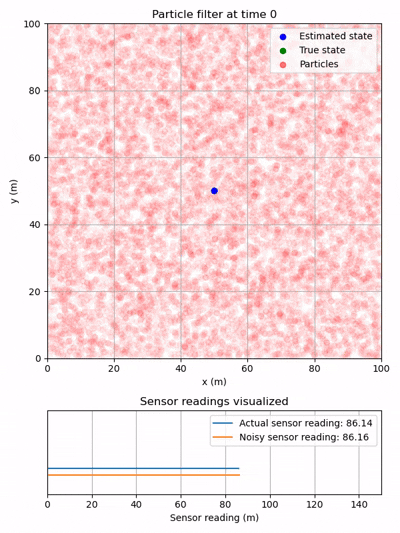

# Multi-threaded Particle Filter

This repository provides a hands-on example of a multithreaded particle filter, inspired by the core concepts outlined in [Particle Filters: A Hands-On Tutorial](https://pmc.ncbi.nlm.nih.gov/articles/PMC7826670/). The implementation is written in modern C++, with the flexibility to toggle multithreading on or off through a simple boolean flag, making it easy to experiment with both single-threaded and parallel execution.

On an AMD 9950X (16 cores / 32 threads, boosting to ~5.7 GHz), the benefits are clear. The multithreaded implementation completes a full particle‑filter update cycle in 34.25 ms, whereas the single‑threaded version requires 456.28 ms on average. A similar pattern appears on a mobile i9‑13900H (14 cores / 20 threads, boosting up to 5.40 GHz), where the multithreaded version completes in 106 ms compared to 569.43 ms for the single‑threaded run. Across both architectures, the multithreaded design delivers a benifical speedup, enabling lower latencies or a larger search space.

# Robot State & Sensor Model
In this example, the system estimates a 2D state consisting of xy coordinates. The simulated sensor is modeled as a distance sensor that measures, with its base fixed at the origin. This setup provides a straightforward yet illustrative way to explore how particle filters integrate sensor readings into state estimation.

Robot state: 
```math
\textbf{x} = \begin{bmatrix}
x\\
y 
\end{bmatrix}
```

Sensor model : 
```math
s = \sqrt{\left( x-\mathcal{O}_x \right)^2 + \left( y-\mathcal{O}_y \right)^2}
```

# Robot Behavior
The "robot" in this example follows a simple but dynamic routine:
* It randomly generates a waypoint in the 2D plane.
* Using a fixed step size, it begins moving toward that waypoint.
* Once the waypoint is reached, a new random target is generated, and the process repeats.

The main steps of a particle filter regardless of the number of threads is:

# Predict
1. Update weights based on sensor reading
    1. Get particle filter estimate $\hat{x}$.
1. Resample particles based on weights
1. Mutate the particles for new exploration

# Update
1. Move particles based on control input



# Installation and running this code

## 1.1 Windows (MinGW)
Install MinGW toolchain
You need a GCC compiler and Make backend compatible with CMake.

You can download mingw directly here: https://www.mingw-w64.org/downloads/#mingw-w64-builds
Once it's installed run the following command in the mingw terminal to install the nessary packages:
```bash
pacman -S mingw-w64-x86_64-gcc mingw-w64-x86_64-make
```

#### Add MinGW to PATH
This ensures gcc, g++, and mingw32-make are available globally:
```bash
C:\msys64\mingw64\bin
```

#### Initialize submodules
Install the optinal submodules for profiling and testing:
```bash
git submodule update --init --recursive
```

## Basic Windows build (no Tracy)
This configures CMake to use the MinGW generator and builds the project:
```bash
cmake -B build -G "MinGW Makefiles"
cmake --build build
```
### Build with Tracy enabled
Adds -DTRACY_ENABLE=ON, which enables Tracy instrumentation and compiles the Tracy client:
```bash
cmake -B build -G "MinGW Makefiles" -DTRACY_ENABLE=ON
cmake --build build
```

## 1.2 Linux
On Linux you can enable Tracy, ThreadSanitizer, or unit test coverage.

## Basic Linux build
This is the standard no options linux build:
```bash
cmake -B build
cmake --build build
```

### Build with Tracy enabled
Adds -DTRACY_ENABLE=ON, which enables Tracy instrumentation and compiles the Tracy client:
```bash
cmake -B build -DTRACY_ENABLE=ON
cmake --build build
```

### Build with ThreadSanitizer
Enables -fsanitize=thread and debug info:
```bash
cmake -B build -DSANITIZE=ON
cmake --build build
```

### Build with Tracy + ThreadSanitizer
```bash
cmake -B build -DSANITIZE=ON -DTRACY_ENABLE=ON
cmake --build build
```

### Build with coverage
```bash
cmake -B build \
    -DCMAKE_C_COMPILER=gcc-14 \
    -DCMAKE_CXX_COMPILER=g++-14 \
    -DSANITIZE=OFF \
    -DTRACY_ENABLE=OFF \
    -DCOVERAGE=ON
cmake --build build
```

## 2. Running the Program
### 2.1 Windows
```bash
.\build\particle_filter.exe
```

### 2.2 Linux / macOS
```bash
./build/particle_filter
```


## 3. Generating a Coverage Report
Coverage requires that you built with -DCOVERAGE=ON.

```bash
./build/tests
lcov --capture --directory build --output-file coverage.info

lcov \
    --gcov-tool gcov-14 \
    --capture \
    --directory build \
    --output-file coverage.info \
    --ignore-errors mismatch \
    --ignore-errors negative \
    --ignore-errors unused \
    --rc geninfo_unexecuted_blocks=1

lcov \
    --remove coverage.info \
    "/usr/*" \
    "*/googletest/*" \
    "*/CMakeFiles/*" \
    --ignore-errors unused \
    --output-file coverage.info

genhtml coverage.info --output-directory coverage_html
```

What this does:
- lcov scans the build directory for .gcda and .gcno files
- Produces a combined coverage.info file
- genhtml converts that into a browsable HTML report

## 4. Cleaning the Build Directory
Windows PowerShell
```bash
rm -r -force build
```

Linux/macOS
```bash
rm -rf build
```

## 5. Notes
- ThreadSanitizer only works on Linux.
- Tracy requires running the Tracy UI separately to view profiling data.
- Tracy + TSan will produce warnings inside Tracy itself, these are expected and harmless.
- Windows supports only Tracy.
- Tracy will not work within WSL Ubuntu
- Linux supports Tracy, sanitizer, and coverage.
